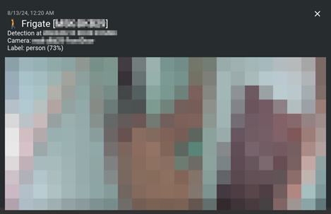
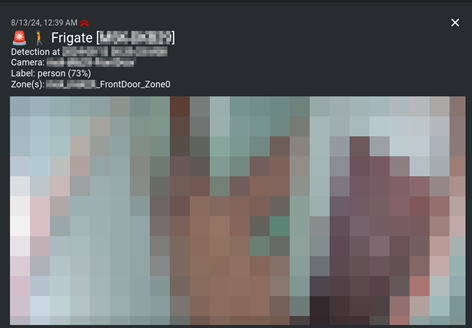

# Templates

Frigate-Notify allows for certain configuration values to be customized using [Golang text templates](https://pkg.go.dev/text/template). Templates are currently supported on alert titles, alert messages, and HTTP headers.

## Alert Templates

Custom message templates can be defined by configuring the `template` section of any notification provider.

By default, Frigate-Notify includes a few templates that it uses for building notification messages: [HTML](https://github.com/0x2142/frigate-notify/blob/main/templates/html.template), [Plaintext](https://github.com/0x2142/frigate-notify/blob/main/templates/plaintext.template), [Markdown](https://github.com/0x2142/frigate-notify/blob/main/templates/markdown.template), and [JSON](https://github.com/0x2142/frigate-notify/blob/main/templates/json.template). All of these are the same message contents, but formatted differently for different notification providers. As you define your own custom templates, it may be helpful to reference these.

!!! note
    Each notification provider has it's own supported/unsupported formats, so be sure to check before defining a custom template.

    If you run into trouble with building a custom template, try enabling [debug logging](./options.md). Once an event is received, this will log a message with the final rendered template.

Custom messages can be created by utilizing [variables](#available-variables) to fill in details about the event. Any variable can be inserted by using the syntax: `{{ .VariableName }}`. For example, the name of the camera could be inserted by using: `{{ .Camera }}`.

When defining a custom template, it can be configured in a single line:

```yaml
alerts:
  discord:
    enabled: true
    webhook: # Webhook URL
    template: "Looks like {{ .Camera }} spotted a {{ .Label }}!!"
```

Or it could also be configured as multi-line:

```yaml
alerts:
  discord:
    enabled: true
    webhook: # Webhook URL
    template: |
        {{ .Camera }} spotted something!
        The camera seems to think it found a {{ .Label }} 🤔
```

If the `template` configuration is missing or blank under any notification provider, then the default template will be used.

!!! warning
    If your template starts with a variable - It's recommended to wrap your single-line template in quotes (`""`), or use the multi-line method. Otherwise, you may get an error loading the config file.

    So instead of `template: {{ .Camera }} alert!`, use `template: "{{ .Camera }} alert!"`

## Title Template

Template variables can also be used to set the alert title or subject line.

As an example, the following `title` template includes the camera & label information. If the camera `front_door` detected a `dog`, then the notification title would be set to: `Frigate - front_door detected dog`

```yaml title="Config File Snippet"
...
alerts:  
  general:
    title: Frigate - {{ .Camera }} detected {{ .Label }}
...
```

## Header Templates

For alert methods that support sending custom HTTP headers, these headers can also be defined using variables using the same syntax as above. This can allow for some interesting custom behaviors. In addition, headers can load data from [environment variables](#environment-variables) for populating sensitive information like Authorization headers.

As an example, below is an example of altering Ntfy notifications based on the event characteristics:

```yaml title="Config File Snippet"
...
    headers:
      - Authorization: Basic {{ env.Getenv "FN_NTFY_AUTH_BASIC" }}
      - X-Priority: "{{ if ge (len .Zones ) 1 }} 4{{ else }} 3{{ end }}"
      - X-Tags: "{{ if ge (len .Zones ) 1 }} rotating_light, {{ end }}walking"
...
```

The above headers include an Authorization token which is collected from environment variables. They also modify the Ntfy notification priority & tags depending on whether the detected object is within a zone or not.

Let's take a look at how this looks using the sample notification screenshots below. Before the person enters a zone, a Ntfy notification is sent with the default priority (3) & a walking person emoji. However, once that person enters into a zone, the notification is changed to a high priority (4) and includes a `rotating_light` emoji to draw attention to the alert.

| Before object enters zone                         | After object enters zone                          |
|:-------------------------------------------------:|:-------------------------------------------------:|
|  |  |

## Available Variables

The list below doesn't contain every possible variable, just a few of the most common. Most come from the event payload received from Frigate, but a few extras have been added to help make building templates easier.

!!! info
    If you're already familiar with Golang templates, check out [event.go](https://github.com/0x2142/frigate-notify/blob/main/models/event.go). Events received from Frigate are parsed into the `Event` struct, so any of those fields can be used within notifications. Please note that the struct is a combined list of possible fields from both web API & MQTT payloads, which are slightly different. So there may be a few that are only available if you're using the web API event retrieval method, for example.

| Variable Name          | Description                                                                                                              |
|------------------------|--------------------------------------------------------------------------------------------------------------------------|
| .Camera                | Name of camera                                                                                                           |
| .HasClip               | Reports `true` if clip is available                                                                                      |
| .HasSnapshot           | Reports `true` if snapshot is available                                                                                  |
| .ID                    | Frigate event ID                                                                                                         |
| .Label                 | Label of detected object                                                                                                 |
| .StartTime             | Unix timestamp of event start                                                                                            |
| .EndTime               | Unix timestamp of event end                                                                                              |
| .Extra.FormattedTime   | Converted & formatted timestamp of event start <br /> (Uses `alerts > general > timeformat` config setting if specified) |
| .Extra.TopScorePercent | Percent confidence of object detection label                                                                             |
| .Extra.ZoneList        | List of current zones object is in                                                                                       |
| .Extra.LocalURL        | Frigate server URL as specified under `frigate > server`                                                                 |
| .Extra.PublicURL       | Frigate Public URL as specified under `frigate > public_url`                                                             |

## Environment variables

Templates can also retrieve values from environment variables using a built-in `env` function. Environment variables used within templates must contain the `FN_` prefix.

For example, storing an authentication token within an env variable:

```yaml
...
  headers:
    - Authorization: Basic {{ env "FN_AUTH_BASIC" }}
...
```
